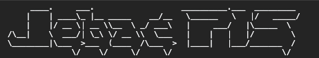

# jebac-pis
Lets you know what values are important in life right now.
Outputs communication to console.

---
## Installation

``$ npm install jebac-pis --save``

``$ yarn add jebac-pis``

## Usage
Add:

``import 'jebac-pis'``

At the top of your main app file.
